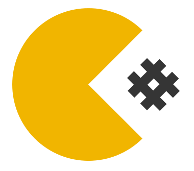

[](https://www.0crat.com/contrib/C7BNDNSNR)

[](http://www.0crat.com/p/C7BNDNSNR)
[](http://www.rultor.com/p/yegor256/tacit)

[](https://travis-ci.org/yegor256/tacit)
[](http://www.0pdd.com/p?name=teamed/yegor256/tacit)
[](https://ci.appveyor.com/project/yegor256/tacit)
[](https://github.com/yegor256/tacit/blob/master/LICENSE.txt)
[](http://badge.fury.io/js/tacit-css)
[](https://github.com/yegor256/tacit/releases)

**Tacit** is a primitive CSS framework for dummies, like myself, who
don't know anything about graphic design but want their web services to
look eatable. No classes, no layouts. Just design plain and simple web pages
compliant with HTML5 and they will look OK.

Details are here: [yegor256.github.io/tacit](https://yegor256.github.io/tacit/)

 Just add it to your HTML (replace `VERSION` with the latest version number,
which you can find [here](https://github.com/yegor256/tacit/releases)): 

```html
<!DOCTYPE html>
<html>
  <head>
    <link rel="stylesheet" href="https://cdn.jsdelivr.net/gh/yegor256/tacit@VERSION/dist/tacit-css-VERSION.min.css"/>
  </head>
</html>
```

Or simply download [`tacit-css.min.css`](https://cdn.jsdelivr.net/gh/yegor256/tacit@VERSION/dist/tacit-css-VERSION.min.css)
and use together with your HTML by adding:

```html
<!DOCTYPE html>
<html>
  <head>
    <link rel="stylesheet" href="tacit.min.css"/>
  </head>
</html>
```

This blog post explains it in even more details:
[Tacit, a CSS Framework Without Classes](http://www.yegor256.com/2015/04/13/tacit-css-framework-for-dummies.html).

## How to contribute

Fork repository, make changes, send us a pull request. We will review
your changes and apply them to the `master` branch shortly, provided
they don't violate our quality standards. To avoid frustration, before
sending us your pull request please run full Grunt build:

```
$ npm install
$ npm test
```

To develop it locally, open `index.html` in a browser and then run:

```
$ npm run dev
```

Now you can make changes to `.scss` files and refresh the page in the browser.
CSS will be recompiled automatically on every change you make.

### Commit messages guidelines

* Every commit/PR should preferably be linked to a Github issue. If it's not, it's recommended to create an Issue first and then commit and open a PR;
* Commit messages should follow this pattern:

```
 #<issue-number> - short description

(optional) * bullet-points with more details if necessary
```
* If the pattern is not followed - commit messages should at the very least reference the `#<issue-number>`.

## Browser/OS Compatibility

The following list is of tested browsers for compatibility.
We don't have any guarantees of compatibility for other browsers,
but as soon as possible will verify and add more to the list.
Some of these browsers present minor issues that are reported in the
our [issues](https://github.com/yegor256/tacit/issues) list.


| Browser/OS        | Version | Compatible |
|-------------------|---------|------------|
| Chrome            | >= 60   | Yes        |
| Firefox           | >= 56   | Yes        |
| Safari            | >= 11   | Yes        |
| Opera             | >= 48   | Yes        |
| Edge              | >= 14   | Yes        |
| Chrome (iOS)      | >= 60   | Yes        |
| Safari (iOS)      | -       | Yes        |
| Internet Explorer | >= 11   | Yes        |


## Built on top of Tacit framework

Tacit's goal is to be super simple and always with the same look-and-feel.
If you want something more custom, like a different theme, feel free to make it on top of Tacit. Here are some frameworks built on top of Tacit:

- [kacit](https://github.com/Kimeiga/kacit) Kacit is the Tacit CSS classless framework but with a yellow accent and Georgia font
- [Bahunya](https://github.com/kimeiga/bahunya) is a CSS framework with responsive typography, navbar, syntax highlighting, and much more, inspired by Tacit

## Usecases of Tacit framework

- [jare.io](http://www.jare.io) Free and instance CDN
- [wring.io](http://www.wring.io) GitHub notification filtering hosted inbox
- [jpeek.org](http://www.jpeek.org) Java projects code cohesion analizer
- [socatar.com](https://socatar.com/) Web service to use profile photos in your page
- [filfreire.com](https://filfreire.com/) [@filfreire](https://github.com/filfreire)'s personal blog on software testing and development
- [moneeee](https://filfreire.com/Moneeee/) joke app to know how much money you're making during a boring meeting
- [soalition.com](https://www.soalition.com/hello) a social coalition management web app for online writers.

## Got questions?

If you have questions or general suggestions, don't hesitate to submit
a new [Github issue](https://github.com/yegor256/tacit/issues/new).


## Logo

Tacit's logo was designed by Akshay Vinchurkar ([@akshayvinchurkar](https://github.com/akshayvinchurkar))

## License (MIT)

Copyright (c) 2015-2018 Yegor Bugayenko

Permission is hereby granted, free of charge, to any person obtaining a copy
of this software and associated documentation files (the "Software"), to deal
in the Software without restriction, including without limitation the rights
to use, copy, modify, merge, publish, distribute, sublicense, and/or sell
copies of the Software, and to permit persons to whom the Software is
furnished to do so, subject to the following conditions:

The above copyright notice and this permission notice shall be included
in all copies or substantial portions of the Software.

THE SOFTWARE IS PROVIDED "AS IS", WITHOUT WARRANTY OF ANY KIND, EXPRESS OR
IMPLIED, INCLUDING BUT NOT LIMITED TO THE WARRANTIES OF MERCHANTABILITY,
FITNESS FOR A PARTICULAR PURPOSE AND NON-INFRINGEMENT. IN NO EVENT SHALL THE
AUTHORS OR COPYRIGHT HOLDERS BE LIABLE FOR ANY CLAIM, DAMAGES OR OTHER
LIABILITY, WHETHER IN AN ACTION OF CONTRACT, TORT OR OTHERWISE, ARISING FROM,
OUT OF OR IN CONNECTION WITH THE SOFTWARE OR THE USE OR OTHER DEALINGS IN THE
SOFTWARE.

